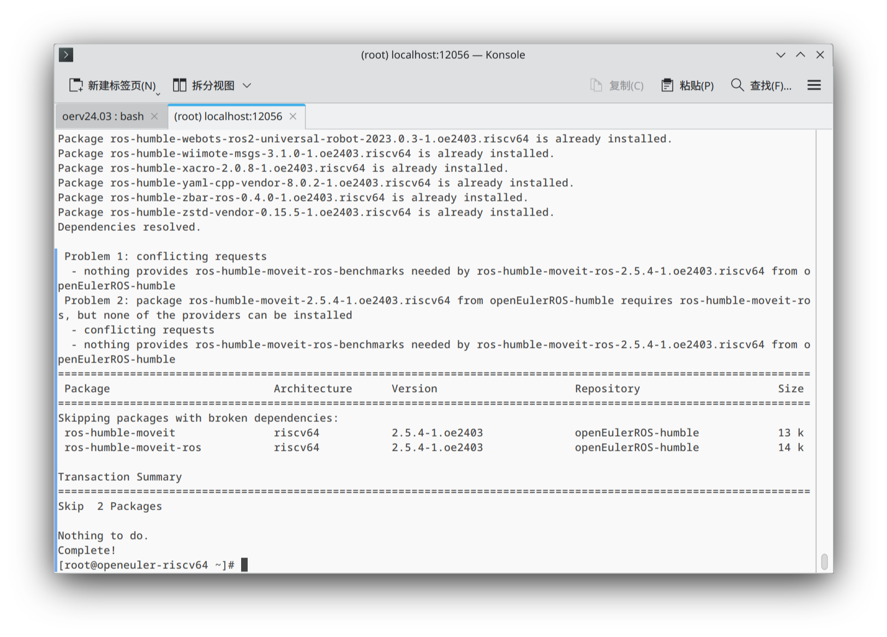
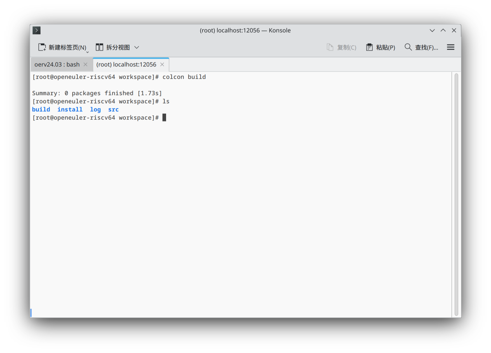
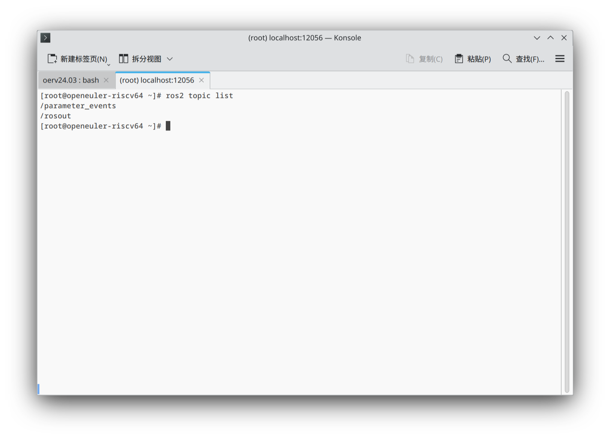
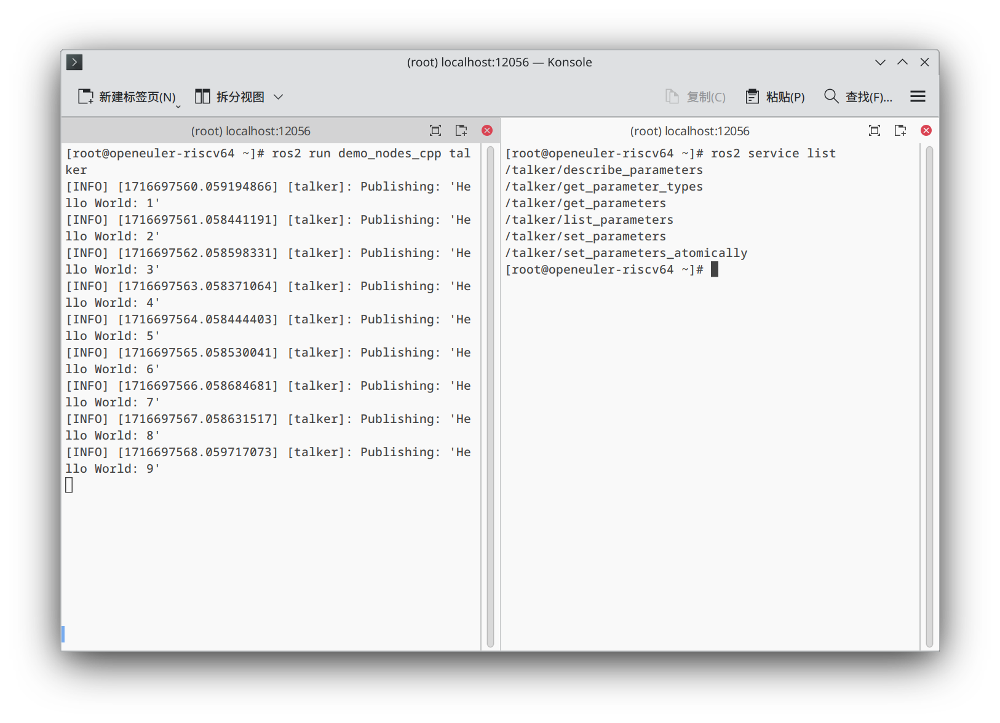
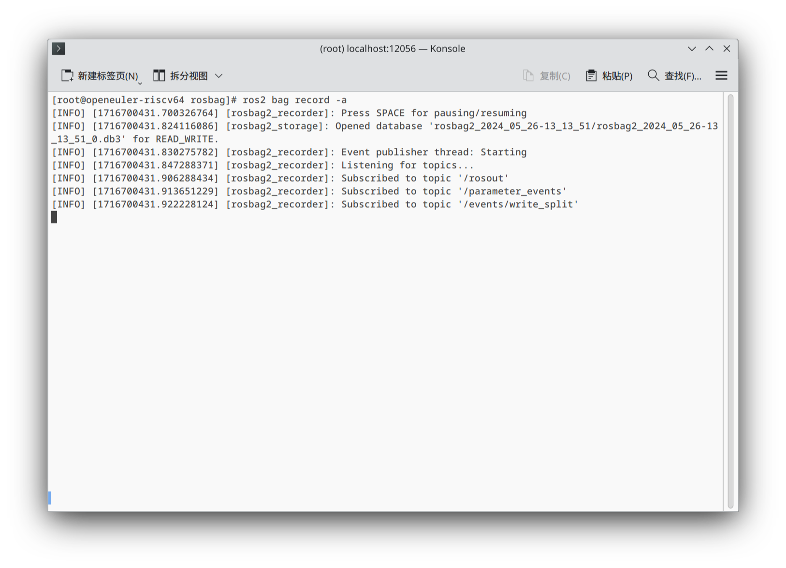
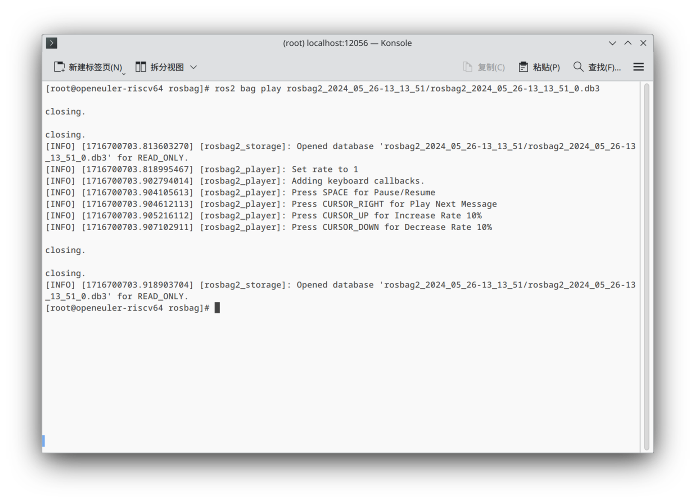
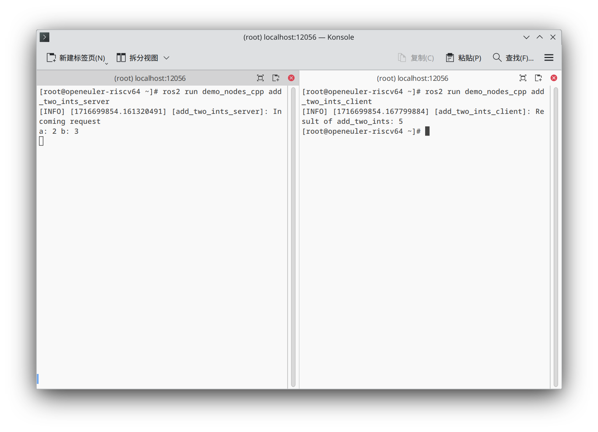
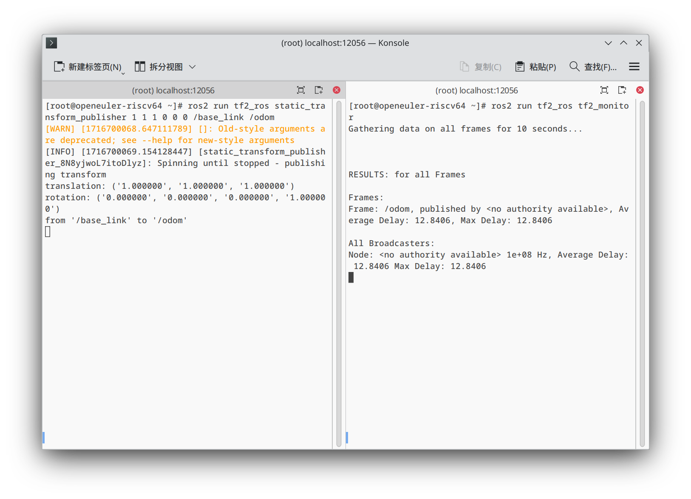
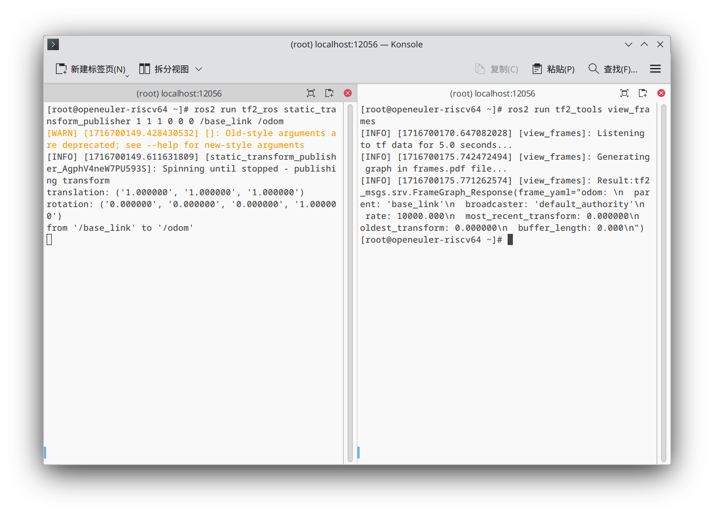

## ROS2 Humble 在 openEuler 24.03 riscv 架构上的测试

### 概述

目前 ros humble 较为完备，能够覆盖绝大部分功能，经测试 ROS-BASE 安装卸载与基础功能正常。

### 环境信息

#### 硬件信息：

1. QEMU openEuler riscv64 虚拟机，QEMU emulator version 9.0.0
2. 处理器 smp 8
3. 内存 8GB

#### 软件信息

1. OS 版本：openEuler-24.03-LTS risc-v
2. 镜像地址：[https://mirror.iscas.ac.cn/openeuler-sig-riscv/openEuler-RISC-V/testing/2403LTS-test/v1/QEMU/openEuler-24.03-V1-base-qemu-testing.qcow2.zst](https://mirror.iscas.ac.cn/openeuler-sig-riscv/openEuler-RISC-V/testing/2403LTS-test/v1/QEMU/openEuler-24.03-V1-base-qemu-testing.qcow2.zst)
3. 软件源：[https://mirror.iscas.ac.cn/openeuler-sig-riscv/openEuler-RISC-V/testing/2403LTS-test/v1/](https://mirror.iscas.ac.cn/openeuler-sig-riscv/openEuler-RISC-V/testing/2403LTS-test/v1/)
4. ROS 软件源：[https://build-repo.tarsier-infra.isrc.ac.cn/openEuler:/ROS/24.03/](https://build-repo.tarsier-infra.isrc.ac.cn/openEuler:/ROS/24.03/)


## 启动虚拟机

在 x86 的机器上需要安装 `qemu-system-riscv64` 来启动 riscv64 的虚拟机，首先获取 [启动脚本](https://mirror.iscas.ac.cn/openeuler-sig-riscv/openEuler-RISC-V/testing/2403LTS-test/v1/QEMU/start_vm.sh) 和 [虚拟机固件](https://mirror.iscas.ac.cn/openeuler-sig-riscv/openEuler-RISC-V/testing/2403LTS-test/v1/QEMU/fw_payload_oe_uboot_2304.bin) 到虚拟机同目录，将上述的镜像解压，在该目录下执行以下命令即可启动虚拟机：

```bash
bash start_vm.sh
```

## 配置软件源

复制 [ROS.repo](./ROS.repo) 到  `/etc/yum.repos.d/ROS.repo`，**或者** 执行以下命令

```bash
bash -c 'cat << EOF > /etc/yum.repos.d/ROS.repo
[openEulerROS-humble]
name=openEulerROS-humble
baseurl=https://build-repo.tarsier-infra.com/openEuler:/ROS/24.03/
enabled=1
gpgcheck=0
EOF'
```

然后执行 `dnf update`

### 安装 ROS-humble 列表软件

软件列表：[packages.list](https://gitee.com/zhtianyu/ros-humble-work/blob/master/ros-humble-test/ROS-humble-rc5-test/packages.list)

执行

```bash
dnf install `cat packages.list` --skip-broken -y
```



安装列表中的软件包，`ros-humble-moveit-ros-benchmarks` 未出包，导致 `ros-humble-moveit-ros` 和 `ros-humble-moveit` 无法安装，其余软件包安装成功。

### 卸载 ROS-humble 列表软件

执行

```bash
dnf remove `cat packages.list`
```

命令正常执⾏，所有软件包被卸载。


## 功能测试

安装上述软件列表后，进行环境配置：

在 `~/.bashrc` 追加 `source /opt/ros/humble/setup.bash`

执行 `source ~/.bashrc `，引入 ROS2 环境。

### 测试 colcon 编译工具测试

`colcon` ⼯具尚未打包，可以通过 `pip` 安装并进⾏测试，依次执⾏下列命令，安装 ROS2 编译工具，进行编译测试。

```bash
[root@openeuler-riscv64 ~]# pip install colcon-common-extensions
[root@openeuler-riscv64 ~]# mkdir -p workspace/src
[root@openeuler-riscv64 ~]# cd workspace/
[root@openeuler-riscv64 workspace]# colcon build
                     
Summary: 0 packages finished [2.01s]
[root@openeuler-riscv64 workspace]# ls
build  install  log  src
[root@openeuler-riscv64 workspace]# 
```

如图，程序正常输出 log，测试通过



### 测试 ros 基础工具相关功能

#### ros2topic

执行

```bash
ros2 topic list
```

如图，程序正常输出 log，测试通过



#### ros2param

执行

```bash
ros2 run demo_nodes_cpp talker
```

新开一个终端，执行：

```bash
ros2 param list
```

如图，程序正常输出 log，测试通过


#### ros2service

执行

```bash
ros2 run demo_nodes_cpp talker
```

新开一个终端，执行：

```bash
ros2 service list
```

如图，程序正常输出 log，测试通过



#### ros2node

执行

```bash
ros2 run demo_nodes_cpp talker
```

新开一个终端，执行：

```bash
ros2 node list
```

如图，程序正常输出 log，测试通过


#### ros2bag

##### ros2 bag record 工具

执行 `ros2 bag record -a` 终端输出如图，程序正常 log



检查当前目录，如下，测试通过


##### ros2 bag info 工具

执行 `ros2 bag info rosbag2_2024_05_26-13_13_51/rosbag2_2024_05_26-13_13_51_0.db3` （文件由上一步骤生成）命令，输出如下，测试通过


##### ros2 bag play 工具

执行 `ros2 bag play rosbag2_2024_05_26-13_13_51/rosbag2_2024_05_26-13_13_51_0.db3` 命令，输出如下，测试通过



#### ros2launch

执行 `ros2 launch demo_nodes_cpp talker_listener.launch.py` 命令，输出如下，测试通过


### 测试 ros 通信组件相关功能

#### topic 通讯方式

##### topic 通信方式 c++ 实现

执行 `ros2 run demo_nodes_cpp talker`， 保存 talker 终端，重新打开一个新的终端执行 `ros2 run demo_nodes_cpp listener`

输出如下，测试通过


##### topic 通信方式 python 实现

执行 `ros2 run demo_nodes_py talker`， 保存 talker 终端，重新打开一个新的终端执行 `ros2 run demo_nodes_py listener`

输出如下，测试通过


#### service 通信方式

##### service 通信方式 c++ 实现

执行 `ros2 run demo_nodes_cpp add_two_ints_server`， 重新打开一个新的终端执行 `ros2 run demo_nodes_cpp add_two_ints_client`

输出如下，测试通过



##### service 通信方式 python 实现

执行 `ros2 run demo_nodes_py add_two_ints_server`， 重新打开一个新的终端执行 `ros2 run demo_nodes_py add_two_ints_client`

输出如下，测试通过


### 测试 ros 坐标转换相关功能

#### 坐标转换的发布和订阅

执行 `ros2 run tf2_ros static_transform_publisher 1 1 1 0 0 0 /base_link /odom` ，在另一个终端中执行 `ros2 run tf2_ros tf2_echo base_link odom`

输出如下，测试通过


#### tf_monitor 监控

在一个终端中执行 `ros2 run tf2_ros static_transform_publisher 1 1 1 0 0 0 /base_link /odom`，在另一个终端中执行 `ros2 run tf2_ros tf2_monitor`

输出如下，测试通过



#### view_frames 保存 pdf 

在一个终端中执行 `ros2 run tf2_ros static_transform_publisher 1 1 1 0 0 0 /base_link /odom`，在另一个终端中执行 `ros2 run tf2_tools view_frames`



输入命令之后，终端存在打印，且程序正常输出 log，并且在当前目录下存在 pdf 文件，测试通过：


